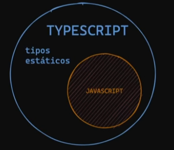

# TypeScript 

Es simplemente JS con una sintaxis para TYPES, es como un ***superset*** de JS.



De todas formas, todo lo que llega al navegador es JS, el TS se compila para convertirse en este último.

En JS es de tipado **debil**, pero a su vez dinámico.

**JS**
```
let a = 'hola' // String
a = 2 // Number

console.log(typeof a) // -> Number
```
En ningun momento, en JS, tenemos que especificar que el tipo de variable que vamos a declarar tiene que ser de algun tipo, ya sea, String, Number, Boolean, etc...

Esto último no es posible en TS, el tipado es fuerte, por lo tanto es necesario mantener el tipo de dato en la variable.

***Nota importante: TS no funciona en tiempo de EJECUCION solo de COMPILACION, eso quiere decir que, el navegador no entiende de TS, lo que ejecuta en realidad es JS. Tampoco es necesario hacer un tipado de todo, mucho menos de los *TIPOS BASICOS, mientras menos tipado tengamos mejor.***

***Lo que nos brinda TS es seguridad, robustez, entre muchas cosas, pero no es una forma de ahorrar codigo, todo lo contrario, vamos a escribir mas codigo.***

**TS**

```
const a: string = 'Hola'
```
Esa es una sintaxis de TS, pero al momento de ejecutase en el navegador desaparece.


*En TS tenemos los TIPOS BÁSICOS: String, Number, Boolean, Null, Undefined, etc...


## Inferencias

**TS es capaz de ver, una determinada variable u objeto, y decirnos su forma o sus tipos.**

```
let text = 'hello'
text.toLowerCase()
```
En este caso, VSC, va a inferir y nos va a decir que tipos de metodos podemos usar con esa variable de de tipo ***String***. En este caso, vemos que entre muchas nos sugirio ***toLowerCase()***.

Cuando no sepa de que tipo se trata la variable, por defecto TS lo califica como **any**.

```
let anyValue: any = 'hello'
```
Al tiparlo con **any**, le decimos a TS que ignore el tipado de TS. Es decir, ya no tomaria como ***String*** a "hello". En este caso, TS no va a inferir con la sugerencia de algún metodo.

La inferencia funciona, también, en las funciones anonimas.

```
const avengers = ['Spidey', 'Hulk', 'Iron Man']

avengers.forEach(function(avengers) {
    console.log(avengers.toUpperCase())
})

```
Al utilizar el *forEach*, ya sabe que son *strings*, y por eso nos empieza a mostrar todos los metodo disponibles para eso.


## Funciones

```
function saludar(name) {
    console.log(`Hola ${name}`)
}

```
En este simple funcion, TS nos va a avisar que el parametro "name" sera implicitamente "any", ya que, no puede saber que tipo de parametro es. Noosotros tenemos que ayudar a TS, a saber como manejar ese tipo.

```
function saludar(name :string) {
    console.log(`Hola ${name}`)
}
```
Diciendole de tipo es (en este caso String), TS puede ayudarnos con las inferencias.

***En JS, las funciones son de 'first class citizen', eso quiere decir que se pueden guardar como variable, se pueden usar como parámetro, etc....***

```
const sayHiFromFunction = (fn) => { 
    return fn('Lukas')
}

sayHiFromFunction((name: string) => { 
    console.log(`Hola ${name}`)
})
```
Esta función espera ser TIPADA, pero no podemos ponerle simplemente que es de de tipo **Function**, seria basicamente decirle que es "any" y pasarle cualquier tipo de función.

```
const sayHiFromFunction = (fn: (name: string) => void) => { 
    fn('Lukas')
}

const sayHi = (name: string) => {
  console.log(`Hola ${name}`)
}

sayHiFromFunction(sayHi)
```
Esta es la forma de TIPAR una función, como no devuelve nada le ponemos **void**. Aunque devolviera algo, no debería importar, con el **void** no habría problemas.

**<-Tipado de ARROW FUNCTIONS->**

```
const sumar = (a: number, b: number): number => {
    return a + b
}
```
Esta sería una forma de TIPAR, pero también se puede omitir, la inferencia va a ser implícita. Pero se puede optar por otra forma de TIPAR.

```
const restar: (a: number, b: number) => number = (a, b) => {
    return a - b
}
```
En este caso, indicamos los TIPO de la función, y luego ponemos la función. De todas formas, no esta tan legible como la primera opción.

Existe el tipado para las funciones que nunca van a devolver nada:

```
function throwError(message: string): never {
    throw new Error(message)
}
```
Se trata de una funcion para manejar errores, lo cual sabemos que no nos devolvera nada (diferencia con *void*), en ese caso utilizamos el tipo *never*. Porque sabemos que la función termina en THROW y no llega hasta el final, no hay *return* implicito.


